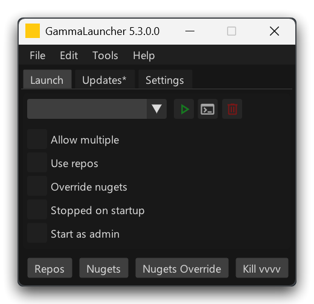

# GammaLauncher

<p align="center">

</p>

_A simple launcher for vvvv gamma_

[](https://visualprogramming.net/)

## Was ist das

GammaLauncher is a simple application that allows to launch vvvv gamma instances with specific arguments from a simple GUI.

## Installation

### Manual

The latest release is available [here](https://github.com/sebescudie/GammaLauncher/releases/latest). You can choose between an installer and a portable version.

### Winget

Open a Terminal window and type

```
winget install GammaLauncher
```

This method will install the launcher and its dependencies (.NET6, `vcredist`). Please note that it takes a few days after a release for the Winget package to be updated.


## Usage

### Initial setup

Open the app and go to the _Settings_ tab. There you can specify the follwing properties :

- vvvv installation folder : this is where the launcher will look for your installed vvvversions. It defaults to `C:\Program Files\vvvv`
- Nuget override : if you want to override the default nuget folder with your own, specify it here
- Extra args : arbitrary arguments the launcher will use when starting a vvvv instance
- Package repositories : all folders you add in this section will be used as package sources. More information [here](https://thegraybook.vvvv.org/reference/extending/contributing.html#source-package-repositories)
- Editable packages : allows listed packages to be modified. Otherwise, vvvv precompiles them and they're read-only

Then go to the _Launch_ tab and pick the version you want to work with in the drop down, select startup arguments with the checkboxes and click the _Launch_ button!

### Updates

When the app starts, it looks online for the most recent vvvv preview builds. If a more recent version is available online, the _Updates_ tab will turn yellow. You can then browse the available builds and click the _Install_ button to download and start the installer. A _Changes_ button allows to view the changelog for this version in your browser. You can also click _Check for updates_ or press <kbd>SHIFT + F5</kbd> at any time to maually look for updates.

### Opening documents

You can drag and drop any VL document from your file browser on the launcher to open it in a new vvvv instance.

## Features

- Run vvvv instances with any combination of [command line arguments](https://thegraybook.vvvv.org/reference/hde/commandline-arguments.html#commandline-arguments) from a simple GUI
- Install and uninstall vvvversions with a single click
- Quickly access useful folders such as installed nugets, default nugets, package sources and so on
- Quickly kill all running vvvv instances
- Quickly start new instances with a specific document by dropping it on the launcher

## Contributing

All suggestions and pull requests are welcome, don't hesitate to report problems and share suggestions in the issues or on the [vvvv forum](http://www.discourse.vvvv.org).