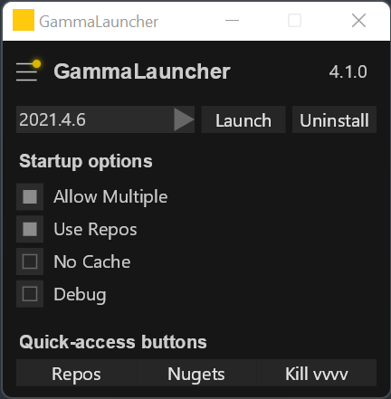

# GammaLauncher

_A simple launcher for vvvv gamma_

## Was ist das

GammaLauncher is a simple application that allows to launch vvvv gamma instances with specific arguments from a simple GUI.

## Usage

When the application first starts, it generates a `settings.xml` file in `%APPDATA\Local\GammaLauncher`. This file contains path to your gamma installations (should be `C:\Program Files\vvvv`), as well as your repositories folder, if you're using that feature. You can customize those paths if needed by editing the settings file. To quickly locate the settings file, press <kbd>CTRL</kbd> + <kbd>,</kbd>.

Then, simply pick the specific gamma version you wanna start from the dropdown menu, and tick the options you wanna use :

- Allow multiple : allows to start more than one `vvvv.exe` at once
- Use repositories : this will ovewrite packages in the default package folder with the ones in your repositories folder, if you specify one. This is usefull if you're building libraries for gamma.
- No cache : doesn't load .vl.dll files and compiles everything from scratch

## Features

- Two buttons at the bottom of the app allow you to quickly access your `package-repositories` folder and installed nugets
- A third one allows to quickly kill all running vvvv instances
- Pressing <kbd>CTRL</kbd>+<kbd>R</kbd> refreshes your installed versions list
- Pressing <kbd>CTRL</kbd>+<kbd>U</kbd> starts the uninstaller associated with the version currently selected in the Dropdown
- Pressing <kbd>CTRL</kbd>+<kbd>,</kbd> takes you to the application's folder so you can quickly edit your settings file
- Mouse scrolling over the vvvversion dropdown allows you cycle through your installed versions without clicking/unfolding it
- If you have _Allow Multiple_ set to true, drag and dropping a `.vl` file on the launcher will open it in a new vvvv instance with all set parameters.
- A burger menu allows to check for two things :
  - If a new version of vvvv gamma exists online. If so, you'll be able to download and install it directly from the launcher with a single click
  - If a new version of GammaLauncher exists online. If so, clicking on the version number takes you to the download page on Github.

## Changelog

### 4.1.1

- Elementa custom styles assignd to Create, resulting in a major performance improvement, thanks to  @bj-rn for this one! (#29)

- Fixes Kill VVVV overlay button not closing when being clicked

### 4.1.0

- When an uninstall succedes, a version scan is triggered so that the dropdown is always up to date
- Fixes drawing of the button pointing to new launche releases
- Now uses a custom icon

### 4.0.1

- Gamma version can be uninstalled with a simple click or via <kbd>CTRL</kbd> + <kbd>U</kbd>
- <kbd>ALT</kbd>+<kbd>E</kbd> will open the selected version's installation folder

### 4.0.0-beta01

- Now supports multiple `--package-repositories` in the settings file
- Settings are now saved in `%APPDATA%\local\GammaLauncher` so that they can persist between updates

### 3.5.3

- Now queries Teamcity API the same way visualprogramming.net does (thanks @antongit and @tebjan for the teamcity madness)
- Forces app to run @60FPS when running in the IDE

### 3.5.2

#### Fixed

- Gets rid of exception if the launcher is started with no internet connection (reported by dottore)

### 3.5.1

#### New

- Massive performance improvement thanks to @gregsn (massive thanks to him) : the app now runs slooooowly when not focused. No more CPU madness!

- A burger menu on the left checks for new gamma versions and installs them. Also tells you if a newer GammaLauncher is available

- Drag and drop a `.vl` document on the launcher to open it in a new vvvv instance (if you have Allow Multiple enabled)

- Pressing <kbd>CTRL</kbd>+<kbd>R</kbd> also checks if newer builds are available online

#### Fixed

- Clicking on nuget folder when a stable version is selected opens the stable gamma's nuget folder. When a preview is selected, it opens preview's nuget folder (asked by motzi)
- Remembers previous window position on startup (asked by dottore)

#### Changed

- Reversed versions order in the dropdown menu. Newer versions are on top (asked by mburk)

## How to get it

Get the latest version in the [here](https://github.com/sebescudie/GammaLauncher/releases), or clone the repo and build the app yourself. If you do so, don't forget to copy the `ico.ico` file to your output dir, otherwise the app won't start.

## Contributing

If you wanna contribute to the app by adding functionalities or whatever, please do so!

cheerz
